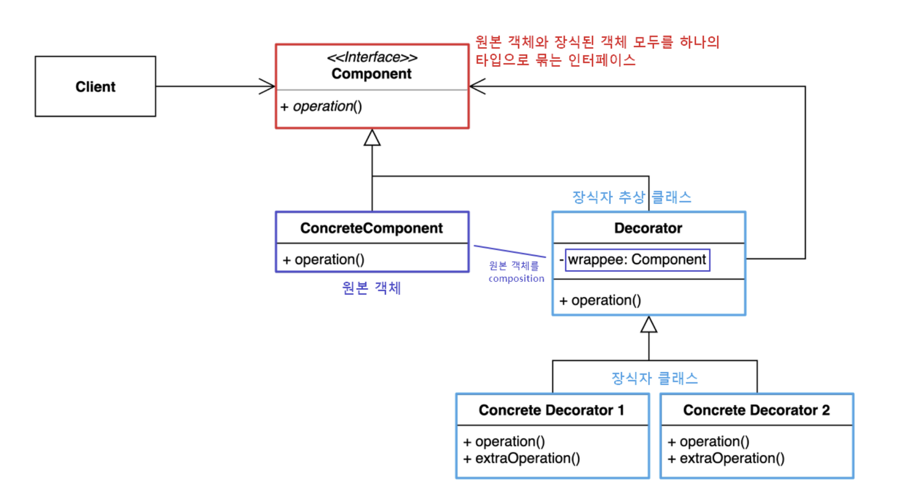

## 상황
- 카페에서 안정화된 주문 시스템을 구축하고 있다.
- 각 음료 클래스는 추상 클래스 Beverage를 상속하고 추상 메소드 cost()를 구현해서 새롭게 정의

## 문제1
- 새로운 메뉴가 추가 & 우유, 두유, 모카등을 추가
- 각각을 추가할 때마다 커피 가격이 올라가야 하기에 주문 시스템을 구현할 때 현재 시스템에서는 계속해서 클래스 생성
- 클래스 "폭팔"

## 해결1
- Beverage 클래스에 각각 첨가물을 boolean 타입으로 추가 상태를 저장하는 변수
- 추상 메소드 cost()를 각각의 첨가물에 따른 가격을 return 하게 구현
- 서브 클래스는 cost()를 오버라이드해서 음료 가격에 super class의 cost() 메소드를 호출해 두 값을 합쳐 값을 return 하도록 구현한다.

## 문제2
- 첨가물의 가격이 바뀔 때마다 기존 코드를 수정
- 첨가물의 종류가 많아지면 새로운 메소드를 추가해야 하고, 슈퍼 클래스의 cost() 메소드도 수정
- 특정 첨가물이 들어가면 안 되는 음료도 있을 수 있다. 예로 아이스 티에 휘핑 추가 메소드가 여전히 상속 받는다
- 고객이 더블 모카를 추가하는 경우

## 상속과 구성
- 상속
  - 상속을 사용한다고 해서 무조건 유연해지거나 관리하기 쉬운 디자인이 만들어 지지 않는다.
  - 서브클래스를 만드는 방식으로 행동을 상속받으면 그 행동은 컴파일할 때 완전히 결정된다.
  - 모든 서브클래스에서 똑같은 행동을 상속받아야 한다.
- 구성
  - 객체의 행동을 확장하면 실행 중에 동적으로 행동을 설정 가능하다.
  - 객체를 동적으로 구성하면 기존 코드를 고치는 대신 새로운 코드를 만들어서 기능을 추가할 수 있다.

## OCP(Open-Closed Principle)  개방-폐쇄 원칙
- 클래스는 확장에는 열려 있어야 하지만 변경에는 닫혀 있어야 한다.
- 기존 코드를 건드리지 않고 확장으로 새로운 행동을 추가하는 것이다.
- 우리가 디자인한 것 중에서 가장 바뀔 가능성이 높은 부분을 중점적으로 살펴보고 OCP를 적용해야 한다.

## 데코레이터 패턴
- 객체의 결합을 통해 기능을 동적으로 유연하게 확장 할 수 있게 해주는 패턴
- 데코레이터의 슈퍼클래스는 자신이 장식하고 있는 객체의 슈퍼클래스와 동일하다.
- 한 객체는 여러 개의 데코레이터로 감쌀 수 있다.
- 데코레이터는 자신이 장식하고 있는 객체와 같은 슈퍼클래스를 가지고 있기에 원래 객체가 들어갈 자리에 데코레이터 객체를 넣어도 상관없다.
- 데코레이터는 자신이 장식하고 있는 객체에게 어떤 행동을 위임하는 일 말고도 추가 작업을 수행할 수 있다.

## 데코레이터 패턴 구조

